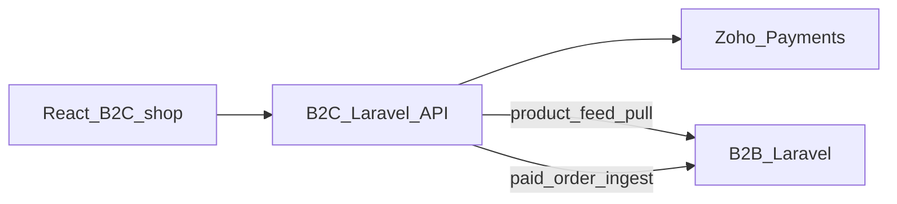

# B2C backend plan (canonical for Cursor)

**Prefer this file over `Mazing-B2C-Backend-Plan.pdf`.** Do not re-read the PDF unless this file is missing a fact.

B2B code: read **only** via [b2b-reference-map.md](b2b-reference-map.md). `B2B/` is gitignored local Laravel 8 reference — do not commit, do not fork.

| Meta | Value |
|------|--------|
| Product | Mazing Business — B2C shop API |
| Audience | Engineering, product, operations |
| Scope | New B2C backend — own server and MySQL |
| Related | Existing B2B Laravel (Mazing Business) |
| Frontend | Existing React B2C shop (API-only; no React hours in this plan) |
| Status | Draft plan for implementation |
| v1 estimate | ~415 hours likely (~10–11 weeks, one backend); ceiling ~510 |

---

## Agent rules (scan these first)

- Greenfield Laravel **11 or 12**. Not Laravel 8. Not a B2B fork. Not Active eCommerce CMS.
- React talks **only** to B2C. Two databases. **Never** write B2B tables from B2C.
- B2C **sells and takes payment**. Fulfilment stays on B2B.
- Keep controllers small. Zoho, product sync, B2B handoff = **services**.
- B2B APIs to add later must be **new thin endpoints**, not hung off `OrderController` or `PurchaseOrderController`.
- v1 is **prepaid Zoho only**. No COD, no credit-days, no SalesZing due check, no challan.
- If B2B handoff fails: order stays **paid** on B2C. Alert + retry. **Do not double-charge.**
- Handoff idempotent on **B2C order id**.
- Product business key: **`part_no`**. HSN on B2B: **`hsncode`**.
- Do not copy `CalculateManagerMCoin` / B2B salesman M-Coins.
- Do not treat `POST v2/payment/generate-url` as Zoho Payments (legacy + SalesZing).

---

## 1. Decisions (locked)

| Topic | Decision |
|-------|----------|
| Framework | Latest Laravel (11/12), not Laravel 8 |
| B2B-only ops | **Not on B2C:** challans, split orders, POs, manager GST signup, packing, e-way, statements |
| M-Coins | Yes — customer points wallet on B2C (not B2B salesman incentives) |
| Catalog | Daily pull copy from B2B; B2C may override locally |
| Accounting | None on B2C for now (no SalesZing, no Zoho Books) |
| Payments | Zoho Payments (payment link + webhook) |
| After order | Push paid order to B2B; B2B processes fulfilment |

---

## 2. Architecture

```
React (B2C shop) → B2C Laravel API → Zoho Payments
B2C Laravel API → scheduled product pull → B2B (read-only product feed)
B2C paid orders → order ingest API → B2B (warehouse / invoice fulfilment)
```



Same engineering family as B2B (Laravel, queues, Sanctum, Zoho Payments) but **separate app and DB**.

### B2B must add two APIs (Phase 2)

1. **Product feed** — published items, warehouse stock, prices, images. Key: `part_no`. Support `updated_since` or full snapshot.
2. **Order ingest** — create a B2B order from a paid B2C order: customer snapshot, line items, warehouse, payment reference. Idempotent on B2C order id.

---

## 3. Ownership

### B2C owns

- Shoppers, addresses, cart, wishlist, checkout
- B2C orders and payment state
- M-Coin ledger (customer loyalty wallet)
- Offers, banners, homepage merchandising
- Local product overrides: title, sell price, images, description, `visible_on_b2c`

### B2B owns

- Product master and real warehouse stock
- Fulfilment (existing order → warehouse → invoice flow)
- Zoho Books (unchanged)

### Shared contract

- `part_no` = product key
- B2C order code (e.g. `B2C-…`) stored on the B2B order as source / reference

---

## 4. Product sync

Nightly (or scheduled) job **on B2C**:

1. Pull B2B feed (`updated_since` or full snapshot).
2. Upsert local `products` and `product_stocks` keyed by `part_no`.
3. **Do not overwrite** B2C override columns.
4. New SKUs: unpublished until merchandised **or** auto-publish. Pick one rule and keep it. **TBD.**

### `product_overrides` overlay

sell price, compare-at price, images, description, badges, `is_published`.

### Stock (v1)

Daily copy is **not** enough at checkout. At **pay time**: check local synced quantity, decrement, reject if insufficient.

Live B2B stock check = **Phase 4**, not v1.

---

## 5. Order and payment flow (v1)

1. Customer checks out on React (OTP user, address, cart).
2. B2C creates order in `pending_payment`.
3. B2C creates Zoho Payment link (same idea as B2B `generatePaymentUrl`). Use **B2C order number**, not B2B invoice or `party_code`.
4. Webhook marks order paid, decrements stock, awards M-Coins.
5. Queue handoff to B2B. Retry. Idempotent on B2C order id.
6. B2B creates its order and processes internally. B2C stores `b2b_order_id` / status if B2B can callback later (callback = Phase 4).

**Not in v1:** credit-days check, SalesZing due check, challan, COD.

**Handoff failure:** stay paid on B2C; alert admin; retry; never double-charge.

---

## 6. M-Coins (B2C wallet)

Customer loyalty. **Not** B2B MCoin / ManagerMCoin (salesman bonuses on invoices/overdue). **Do not copy** `CalculateManagerMCoin`.

| Piece | Role |
|-------|------|
| `m_coin_wallets` | Running balance per shopper |
| `m_coin_transactions` | earn / redeem / expire, linked to order |
| Earn | On paid order — config: percent of net, or flat. **Rates TBD.** |
| Redeem | At checkout — cap e.g. max percent of cart. **Cap TBD.** |
| Admin | Adjust, expiry, history |

Keep rules simple in v1 (earn % + redeem cap). Complex tiers/expiry campaigns = extra hours, not assumed.

---

## 7. B2C API for React (`/api/v1/...`)

| Surface | Endpoints (conceptual) |
|---------|------------------------|
| Public | Home, categories/brands, search, product detail, offers, banners |
| Auth (Sanctum + OTP) | Profile, addresses, wishlist, cart, checkout, orders, M-Coin balance and history |
| Payments | Create Zoho payment link. Webhook that **verifies** Zoho payload |
| Staff | Dashboard counts, B2C orders, product overrides, offers, M-Coin adjustments |

---

## 8. B2C admin (minimal)

- Orders: status, payment, B2B handoff state
- Catalog overrides and publish flag
- Offers / coupons
- M-Coin rules and manual credit
- Users

**No** purchase orders, packing, Zoho Books, or salesman dashboard.

---

## 9. Core data model (v1)

**Create:** `users`, `addresses`, `products` (synced), `product_overrides`, `product_stocks`, `carts`, `wishlists`, `orders`, `order_items`, `payments` (Zoho), `m_coin_wallets`, `m_coin_transactions`, offers / coupons, banners.

**Do not create:** `challan`, `sub_order`, `packing_*`, `purchase_*`, Zoho Books tokens, required `party_code` for shoppers.

Shoppers are **not** B2B dealers. No GST signup on B2C.

**Handoff customer (ops TBD):** new B2B user per shopper **or** one “Mazing Store B2C” account plus shipping snapshot on the order.

---

## 10. What not to copy from B2B

- Laravel 8 / Active eCommerce CMS addons
- Seller / marketplace routes and unused payment gateways (Paytm, Stripe, and similar)
- Nested `api/*.php` SalesZing scripts
- God controllers and hardcoded user IDs
- SalesZing, Zoho Books, statements, 41 Manager, import PO
- Challans, split orders, packing, e-way, manager GST signup

### Reuse as reference only (see b2b-reference-map.md)

- Sanctum + OTP login pattern
- Product field names (`part_no`, HSN/`hsncode`, tax, images)
- Zoho Payments link + webhook pattern (`generatePaymentUrl` / `afterPaymentRedirect` — not Books)
- Queues and jobs (class shape; skip SalesZing/statement jobs)

---

## 11. Delivery phases

| Phase | In v1? | Scope |
|-------|--------|--------|
| 1 — Shop | Yes | Auth, catalog (sync + overrides), product detail, cart, wishlist, checkout, Zoho Pay, order history, basic admin orders |
| 2 — B2B wiring | Yes | Daily product job, paid-order ingest, handoff retries, stock decrement, publish flags |
| 3 — M-Coins + merchandising | Yes | Earn / redeem, offers, banners, reward SKUs if needed |
| 4 — Later | **No** | Live stock API, order-status callback from B2B, Zoho Books, COD |

---

## 12. Hours and modules

Assumptions: one experienced Laravel developer; React already built (backend API only); greenfield Laravel 11/12; Zoho Payments follows B2B payment-link pattern. Hours include implementation, basic automated tests, and B2B wiring. **Excluded:** React UI, merchandising content, production infra beyond a standard deploy.

Hours are **development hours**, not elapsed calendar if the engineer is split onto B2B support.

### Phase totals

| Phase | Low (h) | Likely (h) | High (h) | Calendar (1 backend) |
|-------|---------|------------|----------|----------------------|
| 1 — Shop (APIs + admin + Zoho Pay) | 160 | 180 | 210 | 4.5–5.5 weeks |
| 2 — B2B product feed + order ingest + sync | 80 | 100 | 130 | 2.5–3.5 weeks |
| 3 — M-Coins, offers, banners | 60 | 80 | 100 | 1.5–2.5 weeks |
| QA, hardening, buffer (~15%) | 45 | 55 | 70 | 1–1.5 weeks |
| **Total v1 (Phases 1–3)** | **345** | **415** | **510** | **10–13 weeks** |

Planning number: **415**. Ceiling **510** if B2B ingest is harder than a thin API.

Module table sums ~**441** (mid-range). Use 415 to plan; 510 if ingest under-estimated (B2B controller layer is large).

### Breakdown by module

| Work | Where | Hours |
|------|--------|------:|
| Project setup: Laravel 11/12, Sanctum, queues, structure, env | B2C | 16 |
| Auth: OTP login/signup, profile, addresses | B2C | 28 |
| Catalog models, search/list/PDP APIs, categories/brands | B2C | 36 |
| Product overrides + publish flag + admin catalog | B2C | 20 |
| Cart + wishlist | B2C | 20 |
| Checkout + order create + order history APIs | B2C | 28 |
| Zoho Payments: link, reuse, webhook, paid/failed, retries | B2C | 32 |
| Staff admin: orders, users, dashboard counts | B2C | 24 |
| B2B product feed API (read-only, `part_no`, stock, images) | B2B | 20 |
| B2C daily/hourly sync job + merge without clobbering overrides | B2C | 20 |
| B2B order ingest API (idempotent, shipping snapshot) | B2B | 36 |
| Handoff queue, retries, alerts, store `b2b_order_id` | B2C | 16 |
| Stock decrement at payment + oversell guard | B2C | 10 |
| M-Coin wallet, earn, redeem at checkout, expiry | B2C | 32 |
| M-Coin admin adjust + history | B2C | 12 |
| Offers / coupons APIs + checkout apply | B2C | 24 |
| Banners / home merchandising APIs | B2C | 12 |
| QA, bugfix, deploy hardening (buffer) | Both | 55 |
| **Module sum** | | **441** |

### Phase 4 (not in v1)

| Item | Hours later |
|------|-------------|
| Live B2B stock check at checkout | 16–24 |
| Order-status callback from B2B to B2C | 16–24 |
| COD | 12–20 |
| Zoho Books on B2C (if ever required) | 40–80 |

### Assumptions that change hours

| Assumption | If violated |
|------------|-------------|
| React only needs stable JSON contracts | Extra frontend work is **not** in these hours |
| B2B ingest is a **new thin API**, not a rewrite of `OrderController` | If ingest must mimic full B2B split/challan rules: **+40–80h** |
| One fulfilment warehouse for v1 | Multi-warehouse routing: **+~16h** |
| M-Coin rules stay simple (earn % + redeem cap) | Complex tiers/expiry campaigns: **+~16–24h** |
| Zoho Payments credentials and webhook access on day one | Sandbox delays sit **outside** the estimate |

---

## 13. Risks to settle before build (TBD)

1. **Handoff customer:** new B2B user per shopper vs one B2C dummy customer (“Mazing Store B2C” + shipping snapshot).
2. **Price:** B2B MRP vs B2C sell price (overrides).
3. **Warehouse:** which DC B2C sells from (one DC vs nearest). v1 assumes one warehouse.
4. **Oversell:** sync window vs oversell if stock is not reserved at checkout.
5. **M-Coin numbers:** earn rate, redeem cap, expiry — product must provide numbers.
6. **New-SKU publish rule:** unpublished until merchandised vs auto-publish.

---

## 14. Summary

Build a latest-Laravel B2C shop on its own server. Local catalog copy, synced daily from B2B, with local overrides. Pay with Zoho Payments. Customer M-Coin wallet. Push paid orders to B2B for fulfilment. **No** accounting stack and **no** B2B operations features on this server.

v1 ≈ **415 hours** (~10–11 weeks, one backend), ceiling ≈ **510** if B2B order ingest is harder than a thin API.

Plan is based on current B2B Laravel codebase and client answers on framework, M-Coins, product sync, accounting, and Zoho Books. Hours are backend development unless noted.
